Over the past year, I’ve explored various tools, plugins, and configurations that improve productivity in the terminal. After experimenting and refining, I’ve put together a guide that covers some of the tips, tricks, and scripts I’ve found most helpful.

## Table of Contents

- [Terminal emulators](#terminal-emulators)
  - [Ghostty](#ghostty)
  - [iTerm2](#iterm2)
- [Tools](#tools)
  - [Homebrew – Install anything](#homebrew)
  - [Nerd Fonts – Because icons in texts are cool](#nerd-fonts)
  - [Starship Prompt – The oh-my-zsh alternative](#starship-prompt)
  - [ZSH Auto Suggestions](#zsh-auto-suggestions)
  - [ZSH Syntax Highlighting](#zsh-syntax-highlighting)
  - [Tldr – Like `man` but only the good parts](#tldr)
  - [Bat – Like `cat` but understands code](#bat)
  - [Fd – Like `find` but fast](#fd)
  - [Ripgrep – Like `grep` but fast](#ripgrep)
  - [Fzf – Fuzzy search anything](#fzf)
  - [Jq – Traverse JSON with ease](#jq)
  - [Delta – Like `diff` but readable](#delta)
- [Settings](#settings)
- [Scripts](#scripts)
  - [`cdp` – cd to projects](#cdp-–-%5Bcd%5D-to-%5Bp%5Drojects)
  - [`cde` – cd to projects and open in editor](#cde-–-%5Bcd%5D-to-projects-and-open-in-your-%5Be%5Dditor)
  - [`npmr` – npm run](#npmr-–-%5Bnpm%5D-%5Br%5Dun)
  - [`gbf` – git branch find](#gbf-–-%5Bg%5Dit-%5Bb%5Dranch-%5Bf%5Dind)
  - [`glg` – git log graph](#glg-–-%5Bg%5Dit-%5Bl%5Dog-%5Bg%5Draph)
  - [`myip` – show your IP address](#myip)
  - [`compare_urls` – compare JSON output from URLs](#compare_urls)
- [Git config](#git-config)
- [Vim config](#vim-config)
- [Great built-in tools](#great-built-in-tools)


## Terminal emulators

### [Ghostty](https://ghostty.org/)

Ghostty is a new, lightweight, and superfast GPU-accelerated terminal by Mitchell Hashimoto (HashiCorp, Terraform). It features an easy-to-manage config file and a native UI across platforms.

The main downside is that it currently lacks a built-in output search, but this feature is in progress! github.com/ghostty-org/ghostty/issues/189


### [iTerm2](https://iterm2.com/)

iTerm2 is a feature-rich and highly customizable terminal emulator, though it may be slower than newer alternatives like Ghostty.

This option is great if you search the output often.


## Tools

### [Homebrew](https://brew.sh/)

Homebrew is commonly referred to as the missing package manager for macOS.
Throughout this setup we will use Homebrew a lot to install the different packages and tools we need.
But first we need to install Homebrew! Run the following command, then follow the instructions provided in the output:

#### Installation

```bash
/bin/bash -c "$(curl -fsSL https://raw.githubusercontent.com/Homebrew/install/HEAD/install.sh)"
```

#### Usage

You should now be able to use the command `brew` to install new packages.


### [Nerd Fonts](https://www.nerdfonts.com)

To display custom icons in your terminal, you need a Nerd Font.
Nerd Fonts are regular fonts extended with icons like git symbols, file icons or icons for different programming languages.

#### Installation

Go to [Nerd Fonts downloads](https://www.nerdfonts.com/font-downloads) and download a font of your choice.
To install the font on macOS, unzip the downloaded file and double click the font file. This will open the font in the Font Book app. Click install font.
You could also use the `Geist Mono Nerd Font` which is available in Homebrew. To install, run

```bash
brew install --cask font-geist-mono-nerd-font
```

To use the font in your terminal, open the terminal preferences and select the font you just installed.

#### Usage

You should now be able to see custom icons in your terminal.


### [Starship Prompt](https://starship.rs/)

Starship is a minimalistic, fast and customizable prompt for any shell.

Starship shows you information about your shell environment like the current directory, git branch, package version, exit code and more.

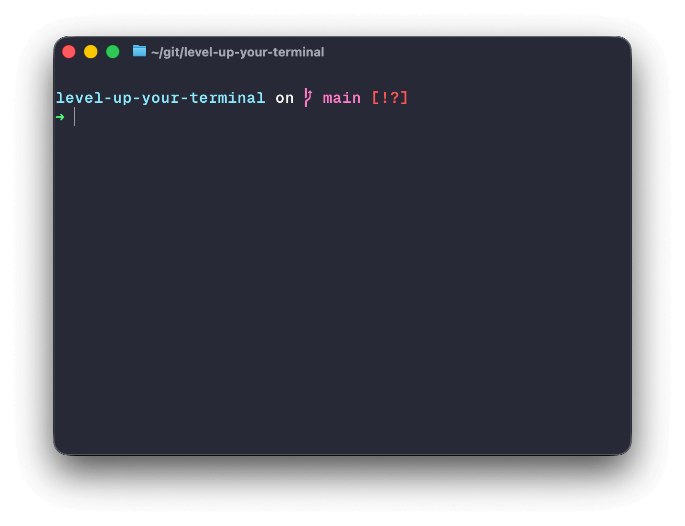

#### Installation

To install, run

```bash
brew install starship

eval "$(starship init zsh)"
```

Add `eval "$(starship init zsh)"` to your `.zshrc`. You can do so by running

```bash
echo 'eval "$(starship init zsh)"' >> ~/.zshrc
```

#### Usage

Next time you open a terminal you should see the Starship prompt.


### [ZSH Auto Suggestions](https://www.github.com/zsh-users/zsh-autosuggestions)

Zsh-autosuggestions is a zsh plugin that suggests commands as you type based on your command history.

#### Installation

To install, run

```bash
brew install zsh-autosuggestions
```

Add it to your `.zshrc` by running:

```bash
echo 'source $(brew --prefix)/share/zsh-autosuggestions/zsh-autosuggestions.zsh' >> ~/.zshrc
```

#### Usage

Next time you open a terminal you should see the auto suggestions as you start typing commands.


### [ZSH Syntax Highlighting](https://www.github.com/zsh-users/zsh-syntax-highlighting)

Zsh-syntax-highlighting is a zsh plugin that highlights commands as you type based on the syntax.

#### Installation

To install, run

```bash
brew install zsh-syntax-highlighting
```

Add it to your `.zshrc` by running:

```bash
echo 'source $(brew --prefix)/share/zsh-syntax-highlighting/zsh-syntax-highlighting.zsh' >> ~/.zshrc
```

#### Usage

Next time you open a terminal you should see the syntax highlighting as you start typing commands.


### [Tldr](https://github.com/tldr-pages/tldr)

When working with command-line tools, man (short for "manual") and tldr (short for "too long; didn’t read") serve similar purposes—helping users understand commands—but they approach it in very different ways.

`man` pages provide exhaustive documentation, covering every possible option, flag, and detail about a command. While useful, they can often be dense, overwhelming, and hard to scan when you're just looking for a quick example.

`tldr`, on the other hand, is designed for efficiency. It offers concise, example-driven summaries of commands, focusing on practical usage rather than exhaustive details. Instead of sifting through paragraphs of technical explanations, you get a handful of real-world examples that show you exactly how to use a command in common scenarios.

| `man ls`                           | `tldr ls`                            |
| ---------------------------------- | ------------------------------------ |
| 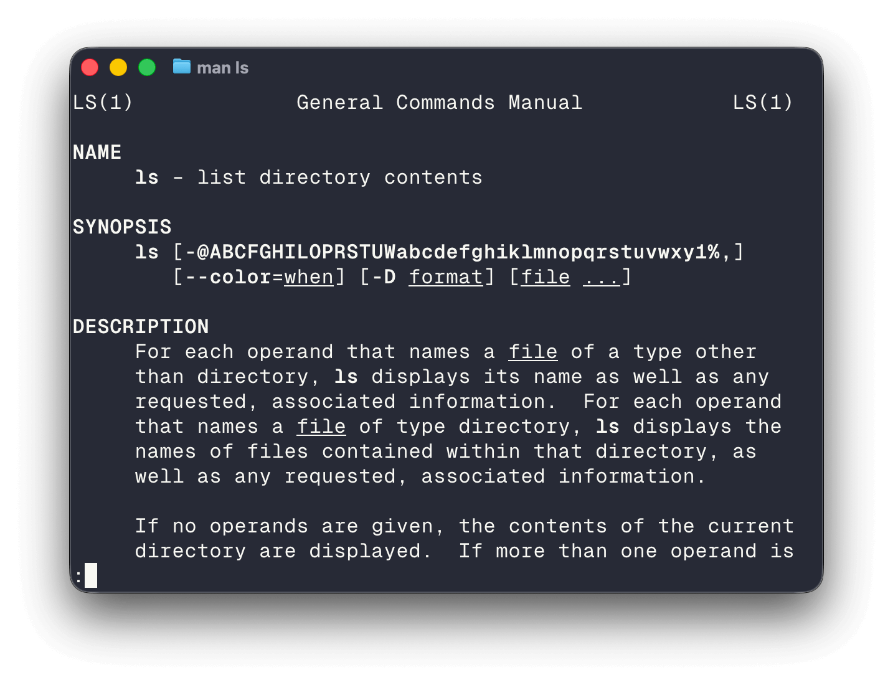 | 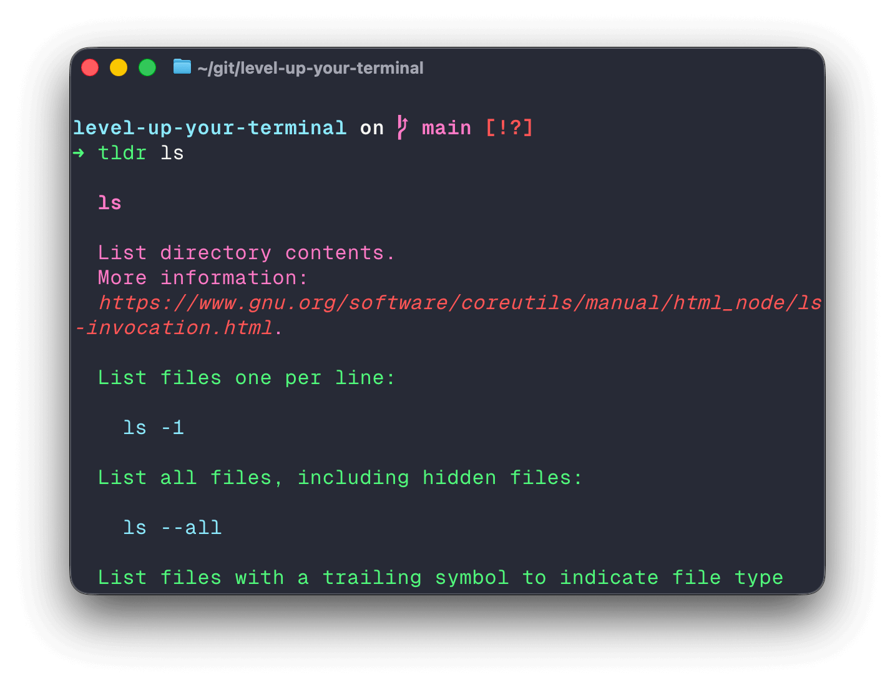 |

#### Installation

To install, run

```bash
brew install tldr
```

#### Usage

You can now use `tldr` to get simplified help pages for different commands.

```bash
tldr ls
```


### [bat](https://github.com/sharkdp/bat)

Bat is a cat clone with wings. It's used to display the content of a file with syntax highlighting.

| cat                                                     | bat                                                     |
| ------------------------------------------------------- | ------------------------------------------------------- |
| 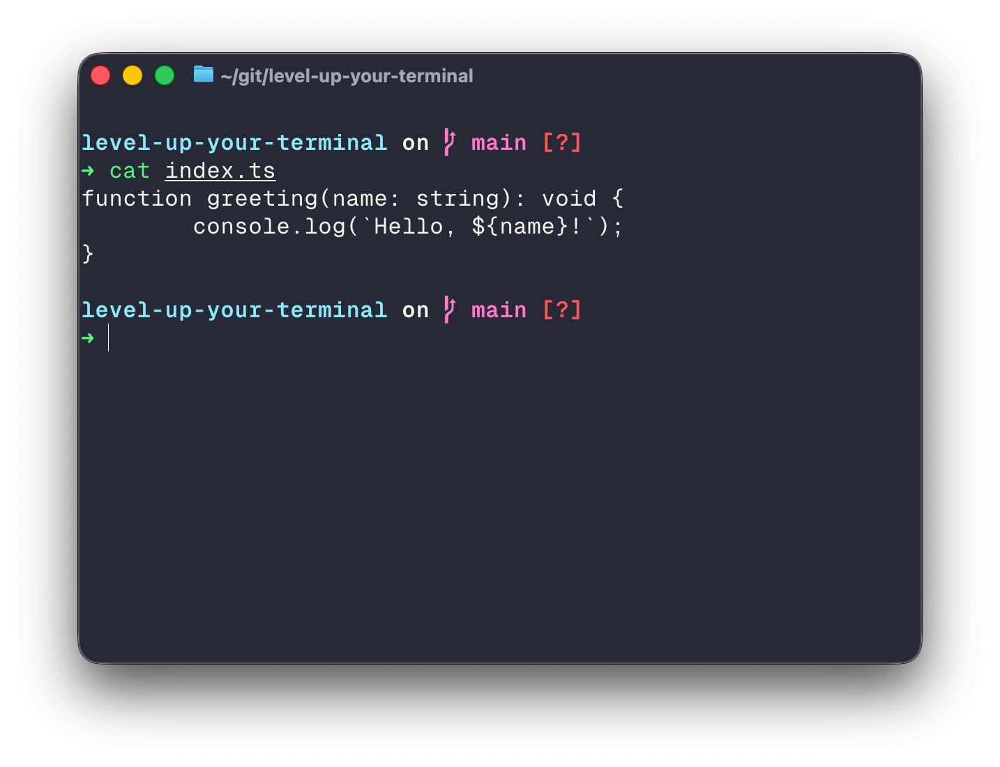 | 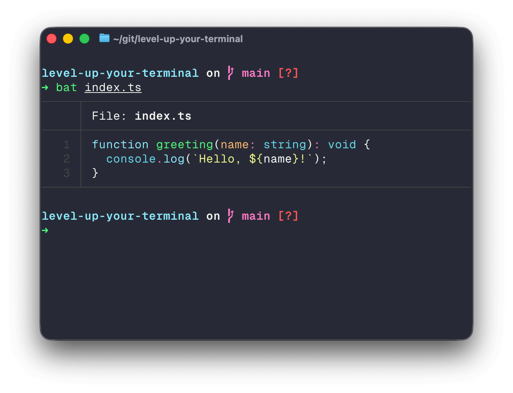 |

#### Installation

To install, run

```bash
brew install bat
```

#### Usage

You can now use `bat` to display the content of a file with syntax highlighting instead of `cat`.

```bash
bat file.ts
```

To find out more run

```bash
tldr bat
```


### [fd](https://github.com/sharkdp/fd)

Fd is a simple, fast and user-friendly alternative to `find`.

#### Installation

To install, run

```bash
brew install fd
```

#### Usage

You can now use `fd` to search for files and directories instead of `find`.

```bash
fd file.ts
```

To find out more run

```bash
tldr fd
```


### [Ripgrep](https://github.com/BurntSushi/ripgrep)

Ripgrep is a line-oriented search tool that recursively searches your current directory for a regex pattern.

#### Installation

To install, run

```bash
brew install ripgrep
```

#### Usage

You can now use `rg` to search for a regex pattern in your current directory.

```bash
rg pattern
```

You can also use `rg` to search for a pattern in a specific file or directory.

```bash
rg pattern file.ts
```

To find out more run

```bash
tldr rg
```


### [fzf](https://github.com/junegunn/fzf)

fzf is a command-line fuzzy finder. It's used to search and select items from a list of items.

#### Installation

To install, run

```bash
brew install fzf
```

Add it to your `.zshrc` by running:

```bash
echo 'source <(fzf --zsh)' >> ~/.zshrc
```

Run the following command to install the key bindings and fuzzy completion:

```bash
$(brew --prefix)/opt/fzf/install
```

#### Usage

You can now use `fzf` to search and select items from a list of items.

You can also use fzf to search through your command history by hitting `Ctrl + R`.

| `ctrl-r`                                      | `ctrl-r` + search                                   |
| --------------------------------------------- | --------------------------------------------------- |
| 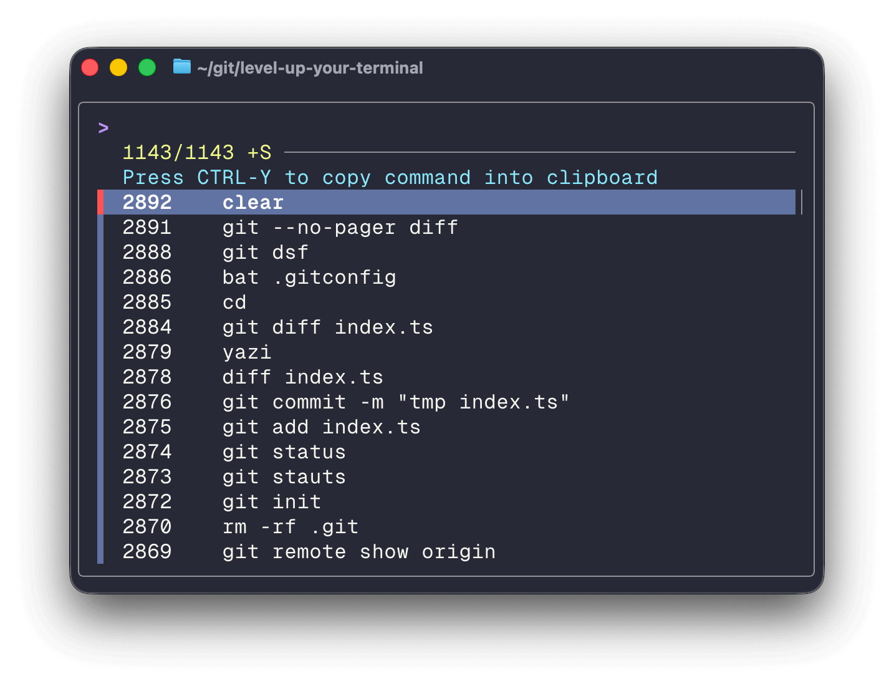 | 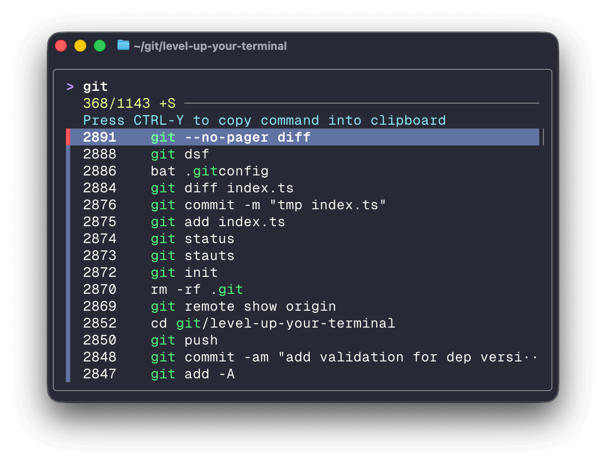 |

In addition you also get the `**` that you can use together with other commands.

For example the following command will let you search for a directory and then cd into it.

```bash
cd **<TAB>
```

Or you can use `**` to search for processes and kill them.

```bash
kill -9 **<TAB>
```

To find out more run

```bash
tldr fzf
```

#### fzf settings

This section covers useful terminal settings, including history management, fuzzy finder defaults, and syntax highlighting to enhance your workflow.

These are just my personal preferences when it comes to settings for fzf.

Add any or all of these to your `.zshrc` file.

```bash
# Set default fzf options: show 60% of the terminal, reverse layout, and a border
export FZF_DEFAULT_OPTS='--height ~60% --layout reverse --border'

# Use 'fd' instead of 'find' for file searches (faster and respects .gitignore)
export FZF_DEFAULT_COMMAND='fd --type f --hidden --exclude .git'

# Preview file content using bat (https://github.com/sharkdp/bat)
export FZF_CTRL_T_OPTS="
  --walker-skip .git,node_modules,target
  --preview 'bat -n --color=always {}'
  --bind 'ctrl-/:change-preview-window(down|hidden|)'"

# CTRL+R: Search command history and copy selected command to clipboard
# CTRL-Y to copy the command into clipboard using pbcopy
export FZF_CTRL_R_OPTS="
  --bind 'ctrl-y:execute-silent(echo -n {2..} | pbcopy)+abort'
  --color header:italic
  --header 'Press CTRL-Y to copy command into clipboard'"

# ALT+C: Fuzzy search directories and preview as a tree
export FZF_ALT_C_OPTS="
  --walker-skip .git,node_modules,target
  --preview 'tree -C {}'"
```


### [jq](https://jqlang.github.io/jq/)

Jq is a lightweight and flexible command-line JSON processor.

#### Installation

To install, run

```bash
brew install jq
```

#### Usage

You can now use `jq` to process JSON data.

```bash
cat file.json | jq '.key1, .key2'
```

To find out more run

```bash
tldr jq
```


### [Delta](https://github.com/dandavison/delta)

Delta is a viewer for git and diff output. It shows you the diff output with syntax highlighting and line numbers.

| diff                                  | delta                                   |
| ------------------------------------- | --------------------------------------- |
| 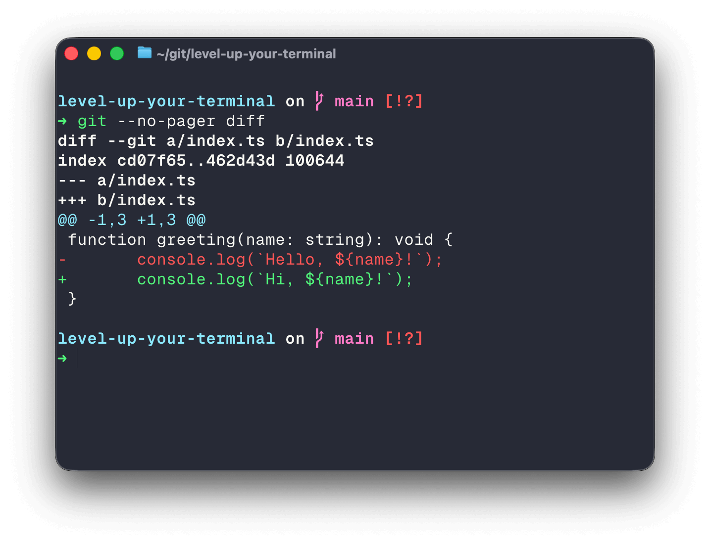 | 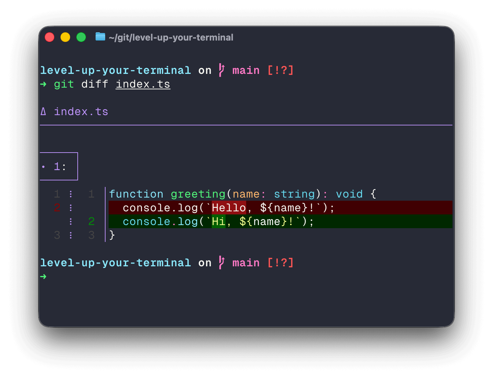 |

#### Installation

To install, run

```bash
brew install git-delta
```

#### Usage

You can now use `delta` to view git and diff output.

```bash
git diff | delta
```

Use delta to compare two branches

```bash
git diff main feature-branch | delta
```

View changes in a single commit

```bash
git show HEAD~1 | delta
```

> [!NOTE]
> You can also configure delta to be your default diff viewer by updating your .gitconfig
> Read more about how in the [Git Configuration](./git-configuration.md#delta) file.


## Settings

```bash
# Do not save commands starting with a space to history.
setopt HIST_IGNORE_SPACE
```

Add it to your `.zshrc` by running:

```bash
echo 'setopt HIST_IGNORE_SPACE' >> ~/.zshrc
```

For my Ghostty settings see [configs/ghostty](./configs/ghostty).


## Scripts

To enable auto lazy-loading of scripts, follow these steps:

> [!NOTE]
> For examples of functions check out the .zsh_functions folder in this repo.

### Installation

1. Create a folder called `.zsh_functions` in your $HOME folder. You can do it by running `mkdir -p "$HOME/.zsh_functions"`
2. Add your scripts to the folder. **Make sure the file name is the same as the function name inside it.**
3. Add the following to your `.zshrc` file.

```bash
fpath=(~/.zsh_functions $fpath)
autoload -Uz ~/.zsh_functions/*
```

#### Example of script in .zsh_functions

> [!IMPORTANT]
> The file in .zsh_functions and the function name itself must be the same.

```bash
# .zsh_functions/myip
function myip {
  ifconfig | grep "inet " | grep -v 127.0.0.1 | cut -d" " -f2
}
```

Available examples

| Function     | Description                                                                                |
| ------------ | ------------------------------------------------------------------------------------------ |
| app-icons    | Generate PWA assets from source images (icons, favicons, splash screens)                   |
| cde          | Fuzzy find and git projects in `~/git` and open the project in your $VISUAL > $EDITOR > vi |
| cdp          | Fuzzy find and git projects in `~/git` and cd into it                                      |
| compare_urls | Compare the JSON output of two different URLs                                              |
| gbf          | Show all local git branches and checkout the selected one                                  |
| glg          | Git log with a nice preview of the diff from the commit                                    |
| gsl          | Show all git stashes and apply, pop, or drop the selected one                              |
| myip         | Print your local IP address                                                                |
| npmr         | Fuzzy find npm scripts in your current project                                             |


### `app-icons`

Generate PWA assets from source images including standard icons, favicons, Apple touch icons, maskable icons, and social share images.

Function definition see [.zsh_functions/app-icons](./.zsh_functions/app-icons).

Dependencies:

- ImageMagick (convert)

Usage:

```bash
app-icons
```

This function generates:
- PWA icons (48x48 to 512x512)
- Apple Touch Icon (180x180)
- Maskable icons with safe zone padding
- Favicons (16x16, 32x32, and favicon.ico)
- OpenGraph and Twitter card images
- iOS splash screen (1125x2436)


### `cdp` – [cd] to [p]rojects

Fuzzy find and cd into folders with a git project.

Function definition see [.zsh_functions/cdp](./.zsh_functions/cdp).

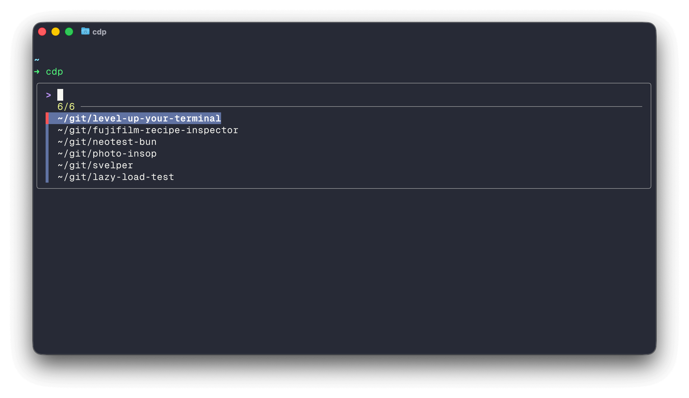

Dependencies:

- fzf

Usage:

```bash
cdp
```


### `cde` – [cd] to projects and open in your [e]ditor

Very similar to `cdp`. Fuzzy find folders with a git project and open them in $VISUAL > $EDITOR > vi.

Function definition see [.zsh_functions/cde](./.zsh_functions/cde).

Dependencies:

- fzf

Usage:

Set `$VISUAL` or `$EDITOR` to open in your editor of choice or it will fallback to `vi`.

To set your editor env you could run the following to set it to VS Code.

```bash
echo "export VISUAL=\"code\"" >> ~/.zshrc
```

```bash
cde
```


### `npmr` – [npm] [r]un

Fuzzy find npm scripts

This will list all the npm scripts in the current project and allow you to fuzzy find and run them.

Function definition see [.zsh_functions/npmr](./.zsh_functions/npmr).

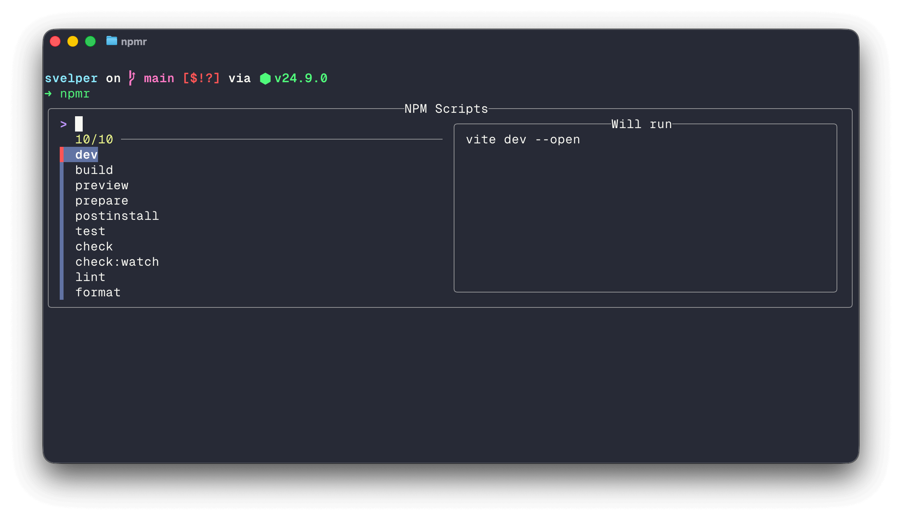

Dependencies:

- jq
- fzf

Usage:

```bash
npmr
```


### `gbf` – [g]it [b]ranch [f]ind

Show all git branches and checkout the selected one.

Function definition see [.zsh_functions/gbf](./.zsh_functions/gbf).

| gbf                                         | gbf + search                                              |
| ------------------------------------------- | --------------------------------------------------------- |
| 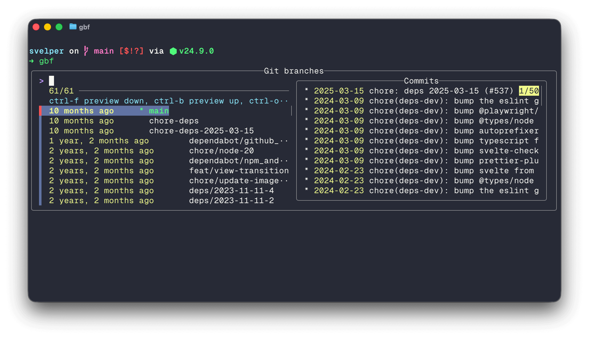 | 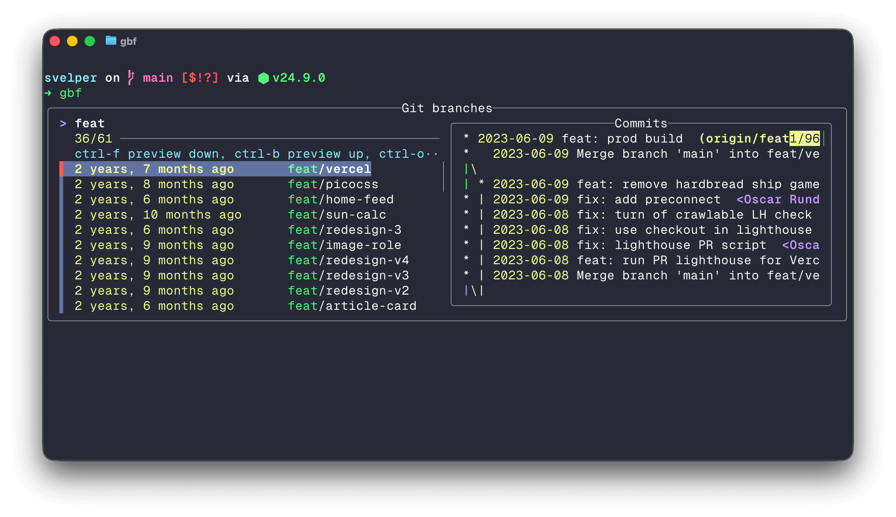 |

Dependencies:

- fzf

Usage:

```bash
gbf
```

Keybindings:

- `enter` – checkout selected branch
- `ctrl-o` – open preview of branch commits
- `ctrl-g` – open the branch on GitHub
- `ctrl-f` / `ctrl-b` – page down/up in preview


### `glg` – [g]it [l]og [g]raph

Git log with a nice preview of the diff from the commit.

From <https://github.com/exosyphon/dotfiles/blob/main/scripts/fshow.sh>

Function definition see [.zsh_functions/glg](./.zsh_functions/glg).

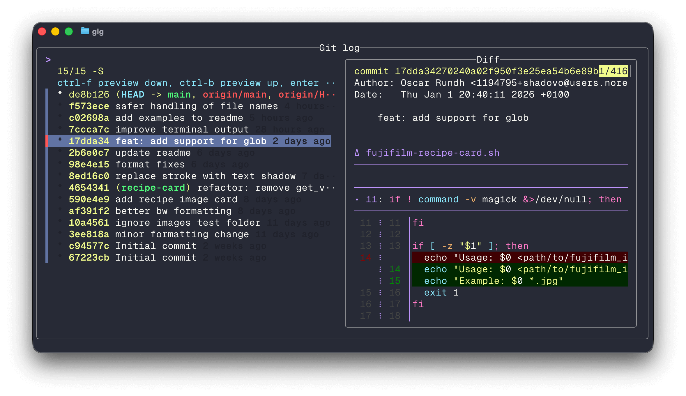

Dependencies:

- fzf
- delta

Usage:

```bash
glg
```

Keybindings:

- `enter` – checkout selected commit
- `ctrl-o` – open full diff preview in less
- `ctrl-y` – copy commit hash to clipboard
- `ctrl-r` – revert the selected commit
- `ctrl-f` / `ctrl-b` – page down/up in preview


### `gsl` – [g]it [s]tash [l]ist

Show all git stashes with a nice preview of the changes. Apply, pop, or drop stashes interactively.

Function definition see [.zsh_functions/gsl](./.zsh_functions/gsl).

Dependencies:

- fzf
- delta

Usage:

```bash
gsl
```

Keybindings:

- `enter` – apply the selected stash
- `ctrl-p` – pop the selected stash
- `ctrl-d` – drop the selected stash
- `ctrl-o` – open full diff preview in less
- `ctrl-f` / `ctrl-b` – page down/up in preview


### `myip`

Show your current IP addresses.

Function definition see [.zsh_functions/myip](./.zsh_functions/myip).

Usage:

```bash
myip
```


### `compare_urls`

Compare the JSON output of two different URLs

This function is useful when you want to compare the output of two different URLs. It fetches the JSON output from both URLs, processes it with `jq` (if provided), and then compares the results using `delta`.

Function definition see [.zsh_functions/compare_urls](./.zsh_functions/compare_urls).

| input                                                                     | output                                                                      |
| ------------------------------------------------------------------------- | --------------------------------------------------------------------------- |
| 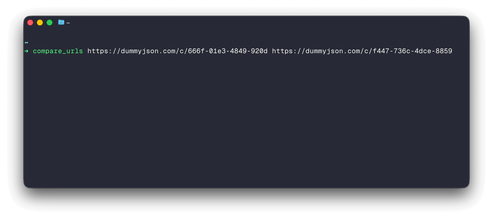 | 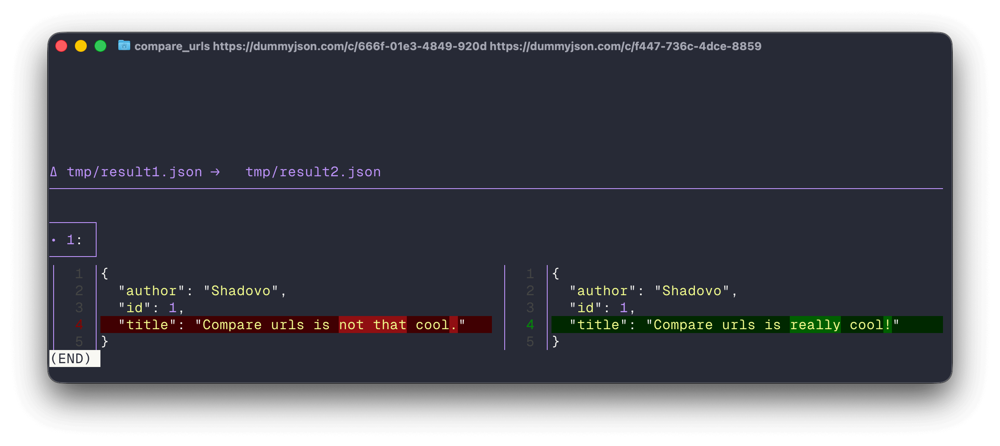 |

Dependencies:

- curl
- jq
- delta

Usage: `compare_urls <URL1> <URL2> [<jq_query1>] [<jq_query2>]`

Examples:

Compare the full output of my local response with the response from production.

```bash
compare_urls http://localhost:3000/my-cool-api https://example.com/my-cool-api
```

If you want to narrow the scope and only compare part of the output you can give it a `jq` path to the part of the output you would like to compare. The provided path will be used on both responses.

```bash
compare_urls http://localhost:3000/my-cool-api https://example.com/my-cool-api '.items'
```

If the data has moved from one place in the data structure to an other you can still compare it by providing two `jq` paths. The first path will be applied to the first URLs response and the second will be applied to the second URLs response.

```bash
compare_urls http://localhost:3000/my-cool-api https://example.com/my-cool-api '.items' '.collection'
```


## Git config

See the [Git Configuration](./git-configuration.md) file for details.


## Vim config

See the [Vim Configuration](./vim-configuration.md) file for details.


## Great built in tools

Here is a list of other built in tools that can be really useful.
Check them out with the `tldr` command to learn more about each.

### File Processing

- awk
- sed
- grep
- find
- cut
- sort

### Networking & HTTP

- curl
- tee

### Diff & Text Comparison

- diff
- uniq
- tr
